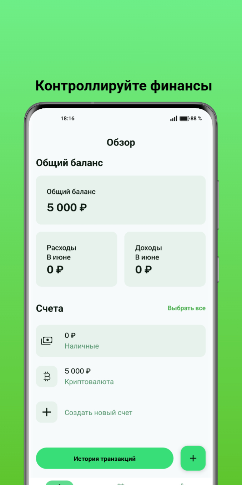
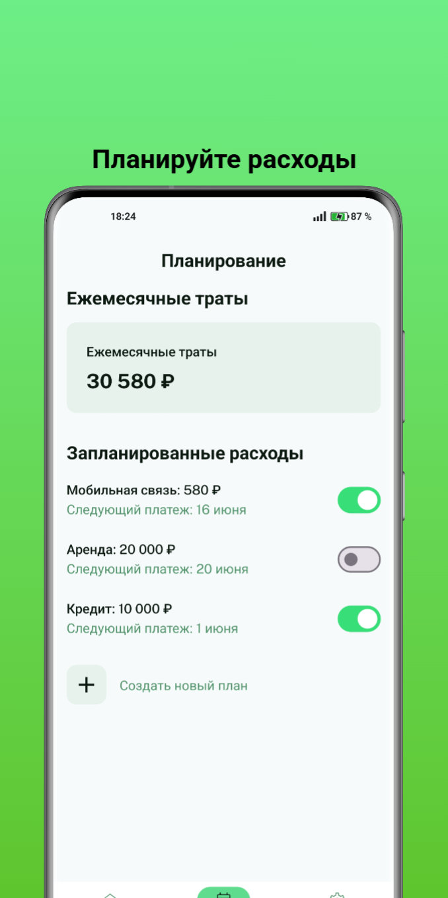
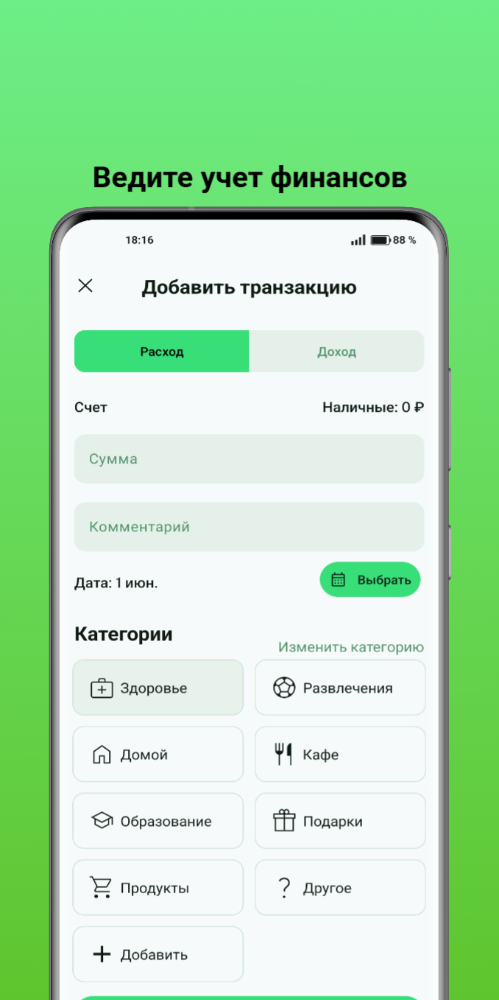
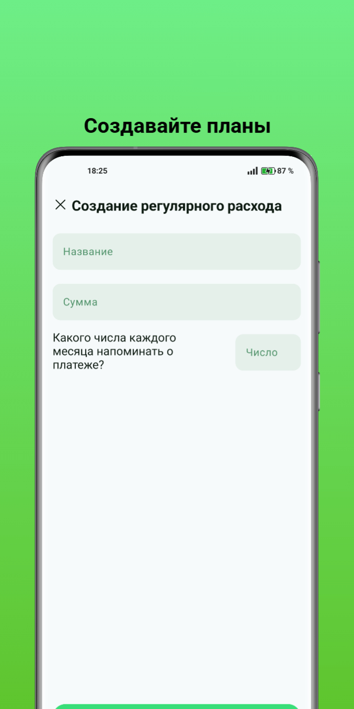
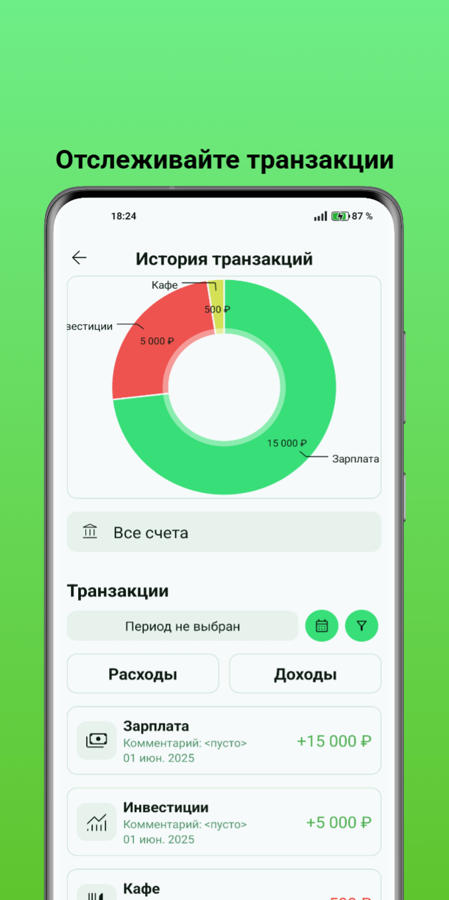

# Money Flow Android App
Приложение для отслеживания личных финансов для Android.

## Возможности

*   **Учет доходов и расходов:** Легко добавляйте и отслеживайте свои доходы и расходы.
*   **Статистика:** Анализируйте свои финансы с помощью наглядных диаграмм и графиков.
*   **Категории:** Организуйте свои транзакции по категориям.
*   **Биометрическая аутентификация:** Защитите свои финансовые данные с помощью отпечатка пальца или распознавания лица.
*   **Динамическая тема:** Тема приложения адаптируется к системной светлой или темной теме.

## Стек технологий и архитектура

*   **UI:** Android Views с ViewBinding
*   **Архитектура:** MVVM
*   **Асинхронное программирование:** RxJava
*   **База данных:** Room
*   **Навигация:** Jetpack Navigation Component
*   **Работа с сетью:** Retrofit
*   **Графики и диаграммы:** MPAndroidChart
*   **Фоновые задачи:** WorkManager

## Скриншоты

| Главный экран | Планирование | Добавление |
| :---: | :---: | :---: |
|  |  |  |

| Планирование | История |
| :---: | :---: |
|  |  |
## Скачать APK

* **[GitHub](https://github.com/sbeu-uwu/MoneyFlow/releases/download/v1.0.0/Money-Flow.apk)**
* **[RuStore](https://www.rustore.ru/catalog/app/com.example.moneyflow)**
